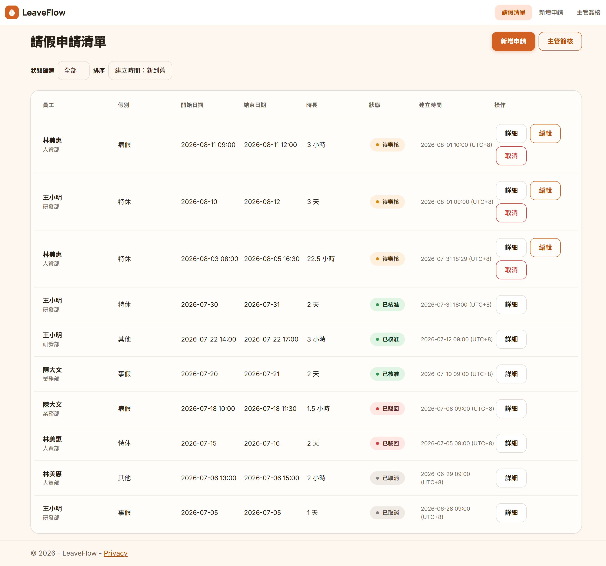
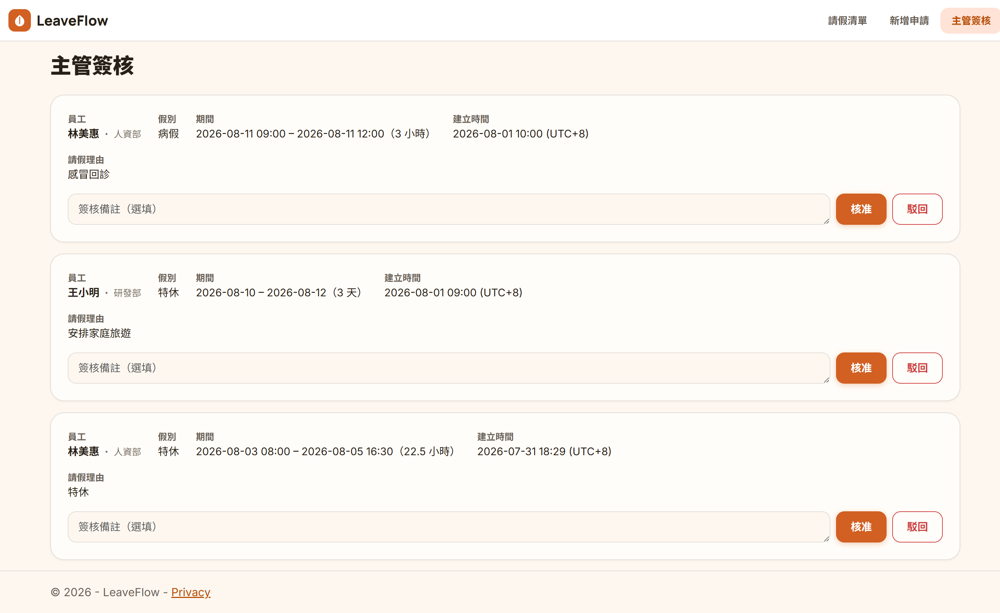
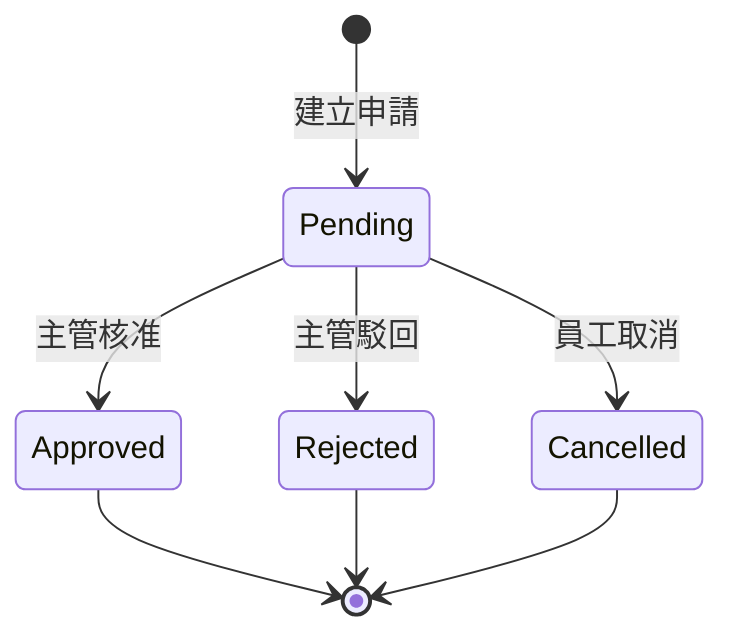

# LeaveFlow｜簡易請假流程管理系統

以 ASP.NET Core MVC 打造的請假申請與簽核系統。員工線上提交請假申請，主管線上核准或駁回，所有申請紀錄與狀態集中管理、可依狀態篩選查詢。

本專案為 Junior Software Engineer 面試作品，聚焦展示 C#／ASP.NET Core MVC／EF Core／PostgreSQL 的基礎串接能力與完整商業流程設計，非正式產品。

## 截圖

**請假申請清單（狀態篩選、Bootstrap badge）**



**主管簽核頁面**



## 技術棧

- **語言**：C#
- **框架**：ASP.NET Core MVC（.NET 10）
- **前端呈現**：Razor Views、HTML、CSS、Bootstrap
- **資料庫**：PostgreSQL（雲端：[Neon](https://neon.tech)）
- **ORM**：Entity Framework Core（`Npgsql.EntityFrameworkCore.PostgreSQL`）
- **機密設定**：User Secrets／環境變數

## 功能列表

- **員工資料（Seed Data）**：以 EF Core `HasData()` 建立 3 位測試員工，隨 Migration 寫入資料庫
- **新增請假申請**：選擇員工、假別（特休／病假／事假／其他），填寫日期與理由，伺服器端完整驗證
- **請假申請清單**：顯示員工姓名、部門、假別、起訖日期、請假天數、狀態（Bootstrap badge）、建立時間；可依狀態篩選（全部／待審核／已核准／已駁回／已取消）
- **請假申請詳細資料**：完整欄位，含簽核備註與簽核時間
- **編輯請假申請**：僅待審核（Pending）可編輯，非 Pending 以 URL 直接進入會被拒絕並導回清單
- **取消請假申請**：僅 Pending 可取消，需二次確認對話框，取消後資料保留（不刪除）
- **主管簽核**：列出所有 Pending 申請，可核准或駁回並填寫簽核備註，重複簽核／簽核非 Pending 申請會被拒絕

## 本機啟動步驟

### 前置需求

- .NET 10 SDK 以上
- 一組可用的 [Neon](https://neon.tech) PostgreSQL 連線字串（或其他 PostgreSQL 服務）

### 1. 還原套件與本機工具

```bash
dotnet restore
dotnet tool restore
```

> `dotnet ef` 需要先有 `dotnet restore` 產生的 `project.assets.json`，否則會噴 `NETSDK1004` 錯誤；純 clone 下來的專案務必先執行這步。

### 2. 設定連線字串（User Secrets）

```bash
dotnet user-secrets set "ConnectionStrings:DefaultConnection" "Host=<your-host>;Database=<your-db>;Username=<your-user>;Password=<your-password>;SSL Mode=Require"
```

> 連線字串不會進入 Git（走 User Secrets／環境變數管理）。上方為 placeholder，請替換成你自己的 Neon 連線資訊。

### 3. 建立資料表（含 Seed 員工資料）

```bash
dotnet ef database update
```

此步驟需手動執行，專案不做啟動時自動 migrate。

### 4. 啟動應用程式

```bash
dotnet run
```

預設網址：`http://localhost:5272`（HTTPS：`https://localhost:7211`）。開啟後會導向請假申請清單頁 `/LeaveRequests`。

## 測試

測試專案位於 `tests/LeaveFlow.Tests`（xUnit + EF Core InMemory Provider），涵蓋 ViewModel／Model 純邏輯、Controller 表單防竄改與狀態守衛、簽核流程與重複簽核防護。

```bash
dotnet test
```

## 資料模型說明

```
Employee
├─ Id           int          PK, Identity
├─ Name         varchar(50)  NOT NULL
└─ Department   varchar(50)  NOT NULL

LeaveRequest
├─ Id           int           PK, Identity
├─ EmployeeId   int           FK → Employee.Id, NOT NULL
├─ LeaveType    int           NOT NULL（enum：Annual/Sick/Personal/Other）
├─ StartDate    date          NOT NULL
├─ EndDate      date          NOT NULL
├─ IsHourly     boolean       NOT NULL, default false
├─ StartTime    time          NULL（以小時計時必填）
├─ EndTime      time          NULL（以小時計時必填）
├─ Reason       varchar(200)  NOT NULL
├─ Status       int           NOT NULL, default Pending（enum，Pending = 0）
├─ CreatedAt    timestamptz   NOT NULL（UTC）
├─ DecisionNote varchar(200)  NULL
└─ DecidedAt    timestamptz   NULL（UTC）
```

請假天數不存欄位，執行時以 `EndDate.DayNumber - StartDate.DayNumber + 1` 計算（曆天數含頭尾）。以小時計時改以 `Hours` 唯讀屬性計算時數（以 0.5 小時為最小單位四捨五入），依 `IsHourly` 決定顯示天數或時數。

## 狀態流轉圖



狀態流轉只有三條路（Pending → Approved／Rejected／Cancelled），無其他轉換；已簽核或已取消的申請資料保留，不做實體刪除。

## 設計取捨說明

- **無登入機制**：系統不實作使用者登入或角色權限控管，「員工」「主管」僅是畫面上的操作情境，任何使用者皆可開啟任一頁面。MVP 不宣稱具備權限控制。
- **請假天數為曆天數**：`EndDate.DayNumber - StartDate.DayNumber + 1`，含頭尾、不排除週末與國定假日，非法定工作日計算。
- **以小時計時數採固定上班時段公式**：全站固定上班時段 09:00–18:00、午休 12:00–13:00 不計入時數；同日直接以結束時間減開始時間，跨日則為「首日淨工時＋中間完整天數 × 8 小時＋末日淨工時」，結果四捨五入至 0.5 小時。中間天數一律以完整工作日（8 小時）計算，不排除週末與國定假日，與天數計算的取捨一致。
- **enum 儲存方式**：`LeaveType`、`LeaveStatus` 皆以 C# enum 實作、存為 int，成員明列固定數值，不留 string 分支。
- **並行競態排除於 MVP**：兩個簽核請求同時讀到同一筆 Pending 申請的情境不做鎖或條件式更新（optimistic concurrency），MVP 明文排除此邊界情況。
- **無實體刪除**：申請一旦建立即保留於資料庫，取消／核准／駁回皆只改變狀態欄位。

## Phase 2 展望

以下項目僅列出方向，不在本 MVP 實作範圍：

- 使用者登入與角色權限（員工／主管帳號區分）
- Email／Slack 通知（申請送出、簽核結果）
- Google Calendar 整合
- 多層簽核流程、法定假別額度與年資計算
- 附件上傳
- 重設示範資料按鈕（一鍵將資料庫還原成初始 Seed 狀態，方便展示／測試）
